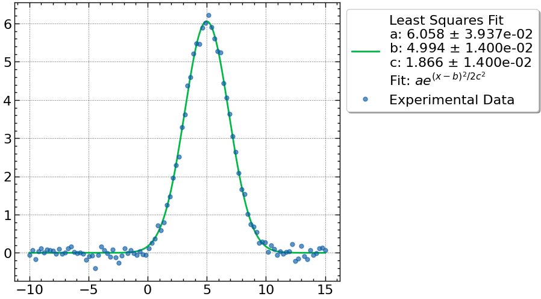

## Use

```python
import numpy as np
from data_plot_utility import LSPlotter
from data_plot_utility import PremadeFunctions
import matplotlib.pyplot as plt
import scienceplots
plt.style.use(["science","notebook","grid"])

# Making Sample Data (Gaussian With Noise)
X = np.linspace(-10,15,100)
y = 6*np.exp(-(X-5)**2/7) + 0.11*np.random.randn(X.size)

# Making figure and axis objects
fig,ax = plt.subplots(1,1)

res,fit_func = LSPlotter.fit_and_plot(
  X,
  y,
  x_err = None # Uncertainties
  y_err = None # Uncertainties
  fit_func=PremadeFunctions.func_gaussian, # function of form def(beta,x):
  beta0=[1,1,1], # values to start search at
  beta_names=["a","b","c"], # names of parameters for labeling
  fig=fig,ax=ax, # for plotting
  latex = "$a e^{(x-b)^2/2c^2}$", # to place equation on label
  ms=5 # marker size
  )
```


